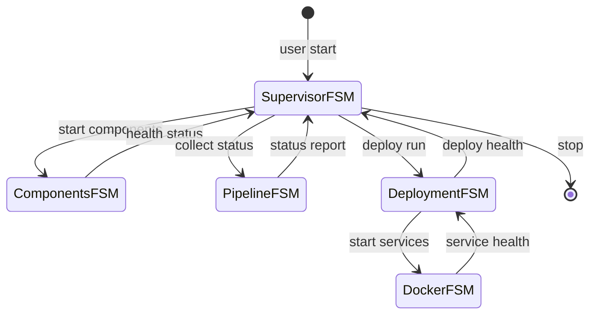

# FSM (implementation actuelle)

## Diagramme global

```mermaid
stateDiagram
  direction TB
  classDef user fill:#e3f0fc,stroke:#2986cc,stroke-width:2px;
  classDef normal fill:#e2f7e1,stroke:#48b96a,stroke-width:2px;
  classDef degraded fill:#ffe279,stroke:#cba600,stroke-width:2px;
  classDef pipeline fill:#ffeac2,stroke:#f89c17,stroke-width:2px;
  classDef docker fill:#e4e4e4,stroke:#888,stroke-width:1.5px;
  classDef fatal fill:#ffe1e1,stroke:#f44336,stroke-width:2px,font-weight:bold;
  classDef stopping fill:#eee,stroke:#888,stroke-width:2px;
  state Initializing {
    direction TB
    [*] --> LoadingConfig
    LoadingConfig --> ValidatingConfig:Config loaded
    ValidatingConfig --> ConfigValid:Validation OK
    ValidatingConfig --> ConfigError:Validation failed
    ConfigValid --> [*]
    ConfigError --> [*]
[*]    LoadingConfig
    ValidatingConfig
    ConfigValid
    ConfigError
[*]  }
  state ComponentsStarting {
    direction TB
    [*] --> StartResourceController
    StartResourceController --> StartDockerManager:Resource Ctrl OK
    StartDockerManager --> StartSuricataManager:DockerMgr OK
    StartSuricataManager --> AllComponentsStarted:SuricataMgr OK
    AllComponentsStarted --> [*]
[*]    StartResourceController
    StartDockerManager
    StartSuricataManager
    AllComponentsStarted
[*]  }
  state SupervisorRunning {
    direction TB
    [*] --> SupervisorMonitoring:Begin monitor
    SupervisorMonitoring --> SupervisorDegraded:Problem detected
    SupervisorDegraded --> SupervisorRecovering:Self-repair
    SupervisorRecovering --> SupervisorMonitoring:Recovered
    SupervisorRecovering --> Stopped:Unrecoverable
    Stopped
[*]    SupervisorMonitoring
    SupervisorDegraded
    SupervisorRecovering
  }
  state Components {
    direction TB
    [*] --> CompStopped:Created
    CompStopped --> CompStarting:start() called
    CompStarting --> CompRunning:Startup OK
    CompStarting --> CompError:Startup failed
    CompRunning --> CompMonitoring:Normal op
    CompMonitoring --> CompHealthy:Health OK
    CompMonitoring --> CompUnhealthy:Problem detected
    CompHealthy --> CompMonitoring:Check cycle
    CompUnhealthy --> CompRecovering:Try recover
    CompRecovering --> CompHealthy:Recovered
    CompRecovering --> CompDegraded:Partial recover
    CompRecovering --> CompError:Recovery failed
    CompDegraded --> CompRecovering:New try
    CompDegraded --> CompError:Critical error
    CompRunning --> CompStopping:stop() called
    CompMonitoring --> CompStopping:stop command
    CompHealthy --> CompStopping:stop command
    CompUnhealthy --> CompStopping:stop command
    CompDegraded --> CompStopping:stop command
    CompError --> CompStopping:stop if possible
    CompStopping --> CompStopped:Fully stopped
    CompStopped --> [*]:Destroyed
[*]    CompStopped
    CompStarting
    CompRunning
    CompError
    CompMonitoring
    CompHealthy
    CompUnhealthy
    CompRecovering
    CompDegraded
    CompStopping
[*]  }
  state Pipeline {
    direction TB
    [*] --> PipeUnknown:Pipeline init
    PipeUnknown --> PipeCollecting:Collect statuses
    PipeCollecting --> PipeProcessing:Collected
    PipeProcessing --> PipeOK:All healthy
    PipeProcessing --> PipeDegraded:Some errors
    PipeProcessing --> PipeKO:All error
    PipeOK --> PipeCollecting:Collect cycle
    PipeDegraded --> PipeCollecting:Collect cycle
    PipeKO --> PipeCollecting:Collect cycle
    PipeOK --> PipeDegraded:Problem develops
    PipeDegraded --> PipeOK:Back to healthy
    PipeDegraded --> PipeKO:Problem worsens
    PipeKO --> PipeRecovering:Try recover
    PipeRecovering --> PipeDegraded:Partial recover
    PipeRecovering --> PipeOK:Full recover
    PipeRecovering --> PipeKO:Recovery failed
[*]    PipeUnknown
    PipeCollecting
    PipeProcessing
    PipeOK
    PipeDegraded
    PipeKO
    PipeRecovering
  }
  state Deployment {
    direction TB
    [*] --> NotStarted:Deploy initialized
    NotStarted --> CheckingPrereq:Start
    CheckingPrereq --> PrereqOK:All prereq valid
    CheckingPrereq --> PrereqFailed:Missing prereq
    PrereqOK --> InstallingDeps:Install dependencies
    PrereqFailed --> [*]:Abort
    InstallingDeps --> DepsInstalled:Deps OK
    InstallingDeps --> DepsFailed:Deps failed
    DepsInstalled --> BuildingDockerImages:Build Docker
    DepsFailed --> [*]:Abort
    BuildingDockerImages --> ImagesBuilt:Built
    BuildingDockerImages --> BuildFailed:Build failed
    ImagesBuilt --> StartingServices:Start svcs
    BuildFailed --> [*]:Abort
    StartingServices --> ServicesStarted:Services started
    StartingServices --> ServicesFailed:Start failed
    ServicesStarted --> VerifyingHealth:Health check
    ServicesFailed --> [*]:Abort
    VerifyingHealth --> HealthOK:OK
    VerifyingHealth --> HealthFailed:Failed
    HealthOK --> Deployed:Deployed
    HealthFailed --> Retrying:Retry
    Retrying --> StartingServices:Retry startup
    Retrying --> [*]:Max retries
    Deployed --> [*]:Success
    HealthOK
[*]    NotStarted
    CheckingPrereq
    PrereqOK
    PrereqFailed
    InstallingDeps
[*]    DepsInstalled
    DepsFailed
    BuildingDockerImages
    ImagesBuilt
    BuildFailed
    StartingServices
    ServicesStarted
    ServicesFailed
    VerifyingHealth
    HealthFailed
    Deployed
    Retrying
  }
  state DockerServices {
    direction TB
    [*] --> DSNotCreated:Service fresh
    DSNotCreated --> DSCreating:Create container
    DSCreating --> DSCreated:Created
    DSCreating --> DSCreateFail:Create failed
    DSCreated --> DSStarting:Start
    DSStarting --> DSRunning:Running
    DSStarting --> DSStartFail:Start failed
    DSRunning --> DSHealthy:Health OK
    DSRunning --> DSUnhealthy:Health NG
    DSRunning --> DSStopping:Stop command
    DSHealthy --> DSRunning:Cycle
    DSUnhealthy --> DSRestarting:Restart auto
    DSUnhealthy --> DSStopping:Manual stop
    DSRestarting --> DSStarting:New start
    DSRestarting --> DSRestartFail:Restart failed
    DSStopping --> DSStopped:Stopped
    DSStopped --> DSRemoving:Remove
    DSRemoving --> [*]:Removed
    DSCreateFail --> [*]:Abort
    DSStartFail --> [*]:Abort
    DSRestartFail --> [*]:Abort
[*]    DSNotCreated
    DSCreating
    DSCreated
    DSCreateFail
    DSStarting
    DSRunning
    DSStartFail
    DSHealthy
    DSUnhealthy
    DSStopping
    DSRestarting
    DSRestartFail
    DSStopped
    DSRemoving
[*]  }
  [*] --> WaitUser:System startup
  WaitUser --> StartCommand:User start system
  WaitUser --> Stopped:User cancels
  StartCommand --> Initializing
  Initializing --> ComponentsStarting:Init success
  Initializing --> Stopped:Config failed
  ComponentsStarting --> SupervisorRunning:All started
  ComponentsStarting --> Stopped:Startup failed
  SupervisorMonitoring --> HealthOK:All healthy
  HealthOK --> SupervisorMonitoring:Cycle
  SupervisorRunning --> Components:Operate components
  SupervisorRunning --> Pipeline:Run pipeline
  SupervisorRunning --> Deployment:Deployment process
  SupervisorRunning --> DockerServices:Supervise Docker
  SupervisorRunning --> Stopping:Stop requested
  [*] --> Stopped:Hard exit
  WaitUser:Awaiting user action
  Stopped:System stopped
  note right of WaitUser 
  <b>Color Legend:</b><br>
      <span style="color:#2986cc">Blue = User states</span><br>
      <span style="color:#48b96a">Green = Healthy/success</span><br>
      <span style="color:#cba600">Yellow = Degraded/recovery</span><br>
      <span style="color:#f89c17">Orange = Pipeline/deployment</span><br>
      <span style="color:#888">Grey = Docker general or stopped</span><br>
      <span style="color:#f44336">Red = Fatal/irreversible</span>
  end note
  class WaitUser,StartCommand user
  class Initializing,ComponentsStarting,SupervisorRunning,SupervisorMonitoring,HealthOK,Components,CompStopped,CompStarting,CompRunning,CompMonitoring,CompHealthy,PipeOK normal
  class SupervisorDegraded,SupervisorRecovering,CompUnhealthy,CompRecovering,CompDegraded,PipeDegraded,PipeRecovering,DSUnhealthy,DSRestarting degraded
  class HealthOK,Pipeline,Deployment,PipeUnknown,PipeCollecting,PipeProcessing,NotStarted,CheckingPrereq,PrereqOK,InstallingDeps,DepsInstalled,BuildingDockerImages,ImagesBuilt,StartingServices,ServicesStarted,VerifyingHealth,Deployed pipeline
  class DockerServices,DSNotCreated,DSCreating,DSCreated,DSStarting,DSRunning,DSHealthy,DSStopped,DSRemoving docker
  class CompError,PipeKO,PrereqFailed,DepsFailed,BuildFailed,ServicesFailed,HealthFailed,Retrying,DSCreateFail,DSStartFail,DSRestartFail fatal
  class Stopped,CompStopping,DSStopping stopping
```

## Details par FSM

### Superviseur (AgentSupervisor / setup.sh)
- **Etats**: WaitUser, StartCommand, Initializing, ComponentsStarting, SupervisorRunning, Stopping, Stopped.
- **Declencheurs**: demarrer() lance StartCommand puis Initializing; arreter() lance Stopping puis Stopped; erreurs d'init ou composants basculent vers Stopped.
- **Implantations**: `webapp/backend/src/ids/app/supervisor.py` (runtime agent) et `setup.sh` (deploiement Raspberry Pi).

### Initializing (sous-FSM)
- **But**: charger et valider la configuration avant le demarrage.
- **Transitions**: LoadingConfig -> ValidatingConfig -> ConfigValid ou ConfigError.
- **Implantations**: `AgentSupervisor.demarrer()` et `setup.sh` (verif config, prerequis, SSH).

### ComponentsStarting (sous-FSM)
- **But**: demarrer ResourceController, DockerManager, SuricataManager.
- **Transitions**: StartResourceController -> StartDockerManager -> StartSuricataManager -> AllComponentsStarted.
- **Implantations**: `AgentSupervisor.demarrer()` et `setup.sh` (connexion SSH, sudo, preparation dossier).

### SupervisorRunning (sous-FSM)
- **Etats**: SupervisorMonitoring, HealthOK, SupervisorDegraded, SupervisorRecovering.
- **Transitions**: HealthOK est transitoire puis retour a SupervisorMonitoring; en cas d'echec la recuperation tente un redemarrage et peut finir en Stopped.
- **Implantations**: `_monitor_loop()` et `_attempt_recovery()` dans `supervisor.py`, et health checks dans `setup.sh`.

### Stopping (sous-FSM)
- **Etats**: StopSuricata, StopDocker, StopResourceController, AllStopped.
- **Implantations**: `AgentSupervisor.arreter()` et `fsm_stop` dans `setup.sh`.

### Components (FSM composant)
- **Etats**: CompStopped, CompStarting, CompRunning, CompMonitoring, CompHealthy, CompUnhealthy, CompRecovering, CompDegraded, CompError, CompStopping.
- **Transitions cles**: demarrer() met CompStarting puis CompRunning; verifier_sante() met CompMonitoring puis CompHealthy/CompUnhealthy; marquer_recuperation() gere Recovering -> Healthy/Degraded/Error; arreter() met CompStopping puis CompStopped.
- **Implantation**: `webapp/backend/src/ids/composants/base.py`.

### Pipeline (FSM d'etat global)
- **Etats**: PipeUnknown, PipeCollecting, PipeProcessing, PipeOK, PipeDegraded, PipeKO, PipeRecovering.
- **Transitions**: collecter() suit Unknown -> Collecting -> Processing -> OK/Degraded/KO; une sortie de KO passe par Recovering avant OK/Degraded/KO.
- **Implantation**: `webapp/backend/src/ids/app/pipeline_status.py`.

### Deployment (FSM de deploiement)
- **Etats**: NotStarted, CheckingPrereq, PrereqOK, InstallingDeps, DepsInstalled, BuildingDockerImages, ImagesBuilt, StartingServices, ServicesStarted, VerifyingHealth, HealthOK, Deployed, HealthFailed, Retrying.
- **Etape Raspberry Pi**: CheckingPrereq et InstallingDeps executent les actions SSH/sudo et preparation du systeme distant.
- **Implantation**: `setup.sh` (fonctions `deploy_transition`, `deploy_fail`, boucle de retry).

### DockerServices (FSM services Docker)
- **Etats**: DSNotCreated, DSCreating, DSCreated, DSStarting, DSRunning, DSHealthy, DSUnhealthy, DSRestarting, DSStopping, DSStopped, DSRemoving et etats d'echec.
- **Implantation**: `setup.sh` (fonction `docker_transition` et demarrages `docker compose`).

## Meta-FSM (transitions inter-machines)

- **Lien principal**: l'etat SupervisorRunning declenche Components, Pipeline, Deployment et DockerServices.
- **Sante**: les checks composants et Docker/Deployment alimentent SupervisorDegraded ou HealthOK.
- **Observabilite**: Pipeline n'impose pas de transition directe, il expose l'etat global.

## Verification de coherence

- **Superviseur**: transitions principales et sous-etats alignes entre `supervisor.py` et `setup.sh`.
- **Components**: les transitions CompRecovering/CompDegraded/CompError sont pilotees par `marquer_recuperation()`.
- **Pipeline**: la transition Recovering peut revenir vers PipeOK, PipeDegraded ou PipeKO selon l'etat collecte.
- **Deployment + Docker**: transitions de retries et d'echec suivent `deploy_transition` et `docker_transition`.
