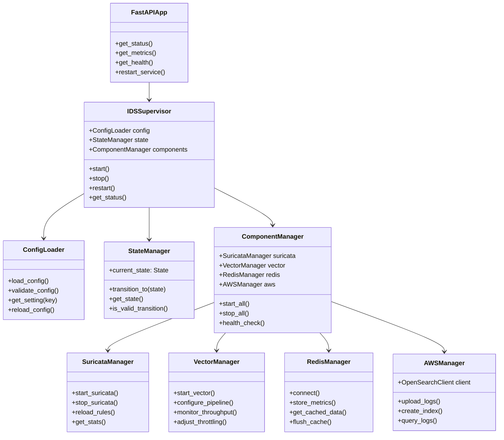
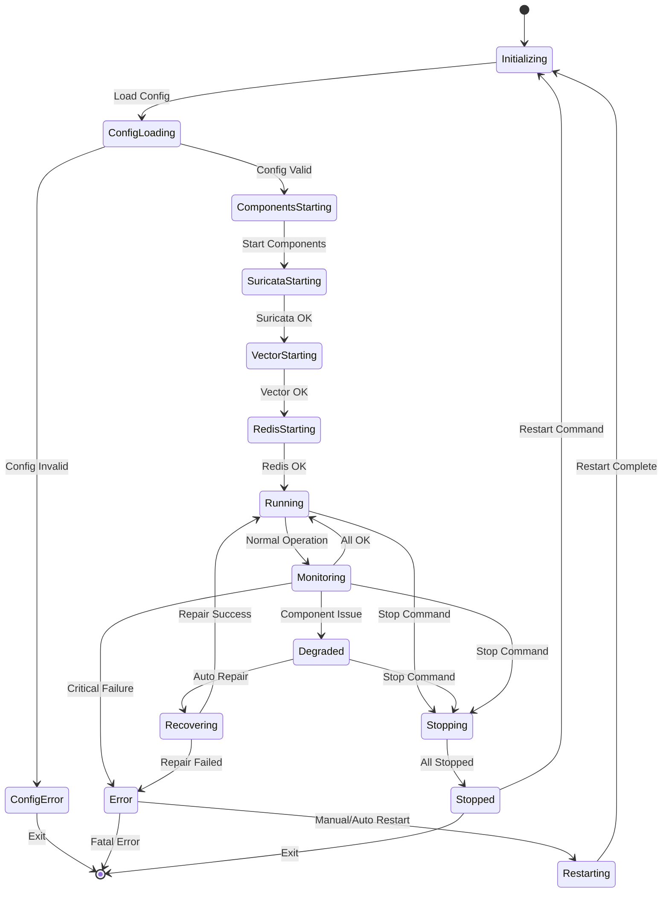

# Architecture IDS2 - Diagrammes Mermaid

## Architecture Système

```mermaid
graph TB
    subgraph "Raspberry Pi Host"
        subgraph "Docker Environment"
            BASE[ids2-python-base<br/>Python 3.12 + Requirements]
            
            subgraph "Core Services"
                RUNTIME[ids-runtime<br/>IDS Agent Supervisor]
                API[ids-api<br/>FastAPI Status API]
            end
            
            subgraph "Data Pipeline"
                VECTOR[vector<br/>Log Collector]
                REDIS[redis<br/>Cache & Buffer]
            end
            
            subgraph "Monitoring Stack"
                PROM[prometheus<br/>Metrics Collection]
                GRAF[grafana<br/>Dashboards]
                CADV[cadvisor<br/>Container Metrics]
                NODE[node_exporter<br/>System Metrics]
            end
        end
        
        subgraph "System Services"
            SURICATA[suricata<br/>IDS Engine]
            SYSTEMD[systemd<br/>Service Manager]
        end
        
        subgraph "Storage"
            RAMDISK[/mnt/ram_logs<br/>RAM Disk]
            LOGS[/var/log/ids<br/>Persistent Logs]
        end
    end
    
    subgraph "External Services"
        AWS[AWS OpenSearch<br/>Log Storage]
        TAILSCALE[Tailscale<br/>VPN Network]
    end
    
    %% Dependencies
    BASE --> RUNTIME
    BASE --> API
    RUNTIME --> API
    SURICATA --> RAMDISK
    RAMDISK --> VECTOR
    VECTOR --> REDIS
    VECTOR --> AWS
    REDIS --> RUNTIME
    RUNTIME --> PROM
    CADV --> PROM
    NODE --> PROM
    PROM --> GRAF
    SYSTEMD --> SURICATA
    SYSTEMD --> RUNTIME
    SYSTEMD --> VECTOR
    SYSTEMD --> REDIS
    
    %% Styling
    classDef docker fill:#e1f5fe
    classDef system fill:#f3e5f5
    classDef storage fill:#e8f5e8
    classDef external fill:#fff3e0
    
    class BASE,RUNTIME,API,VECTOR,REDIS,PROM,GRAF,CADV,NODE docker
    class SURICATA,SYSTEMD system
    class RAMDISK,LOGS storage
    class AWS,TAILSCALE external
```

## Architecture de Classes



## Machine à États (FSM)

