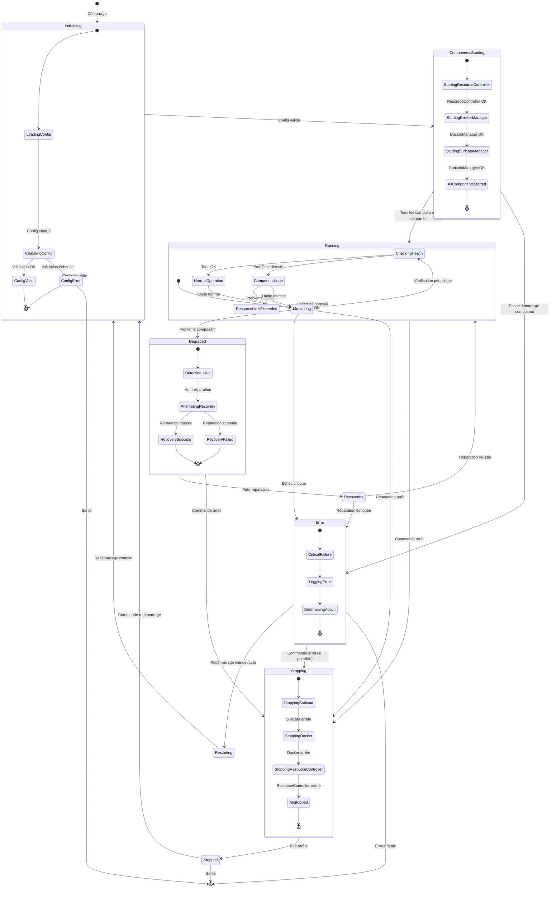
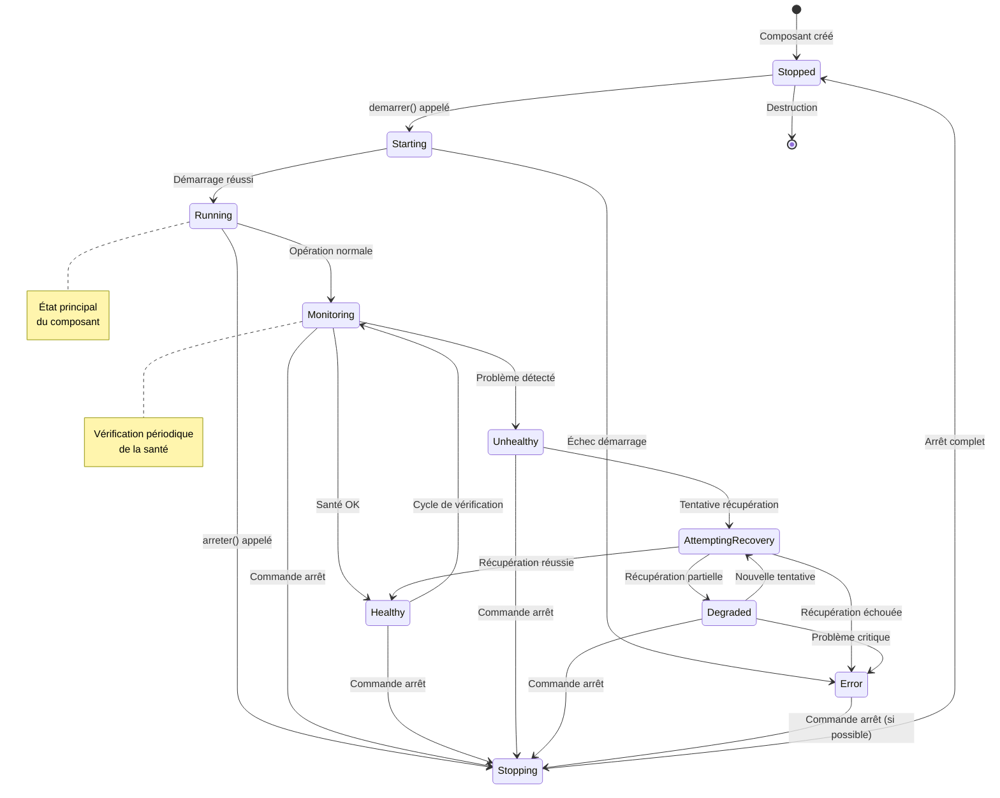
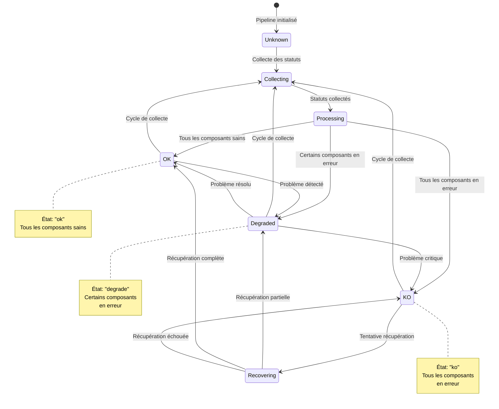
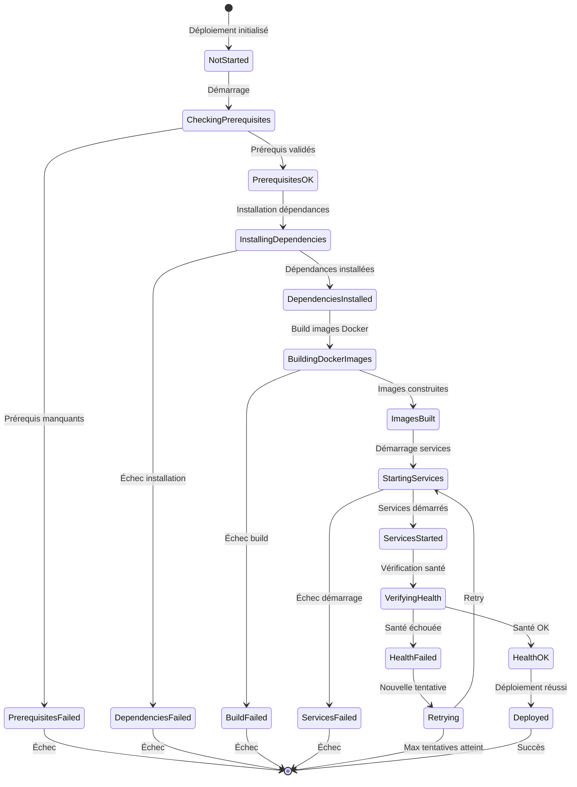
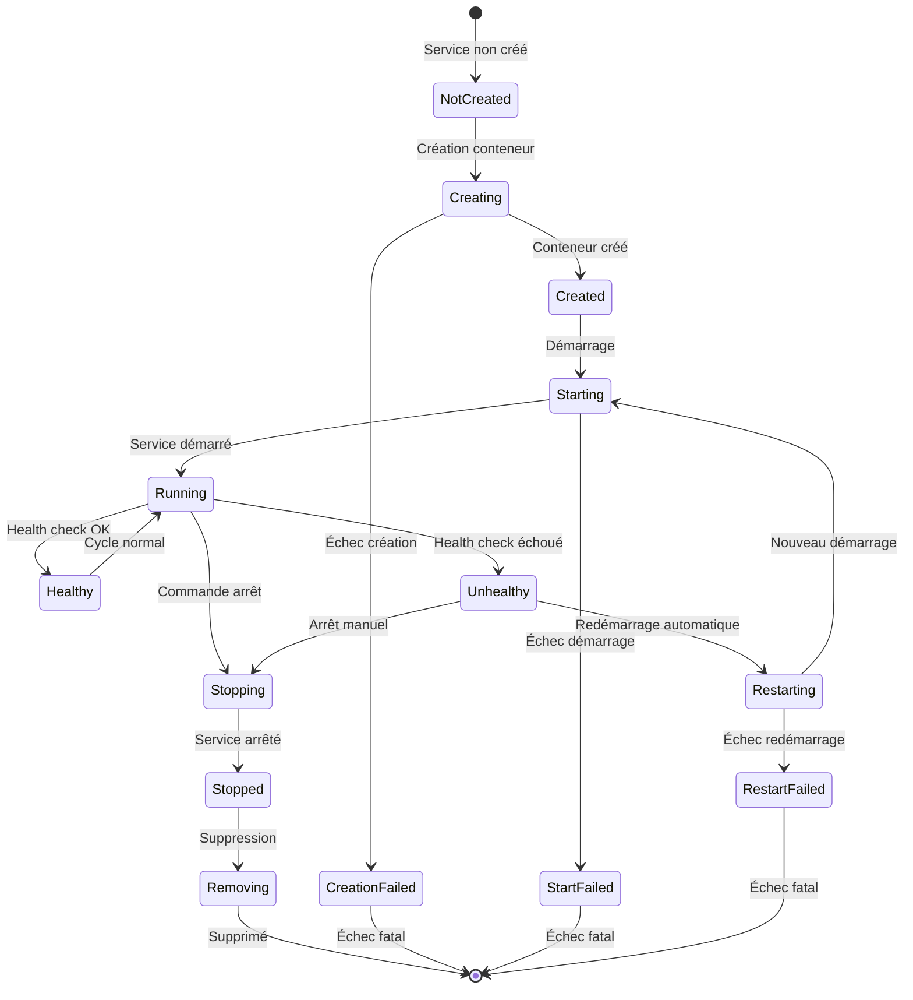

# Diagramme d'État Final - Système IDS2

## Diagramme d'État Principal (Agent Supervisor)

## Diagramme d'État des Composants

## Diagramme d'État du Pipeline

## Diagramme d'État du Déploiement

## Diagramme d'État des Services Docker

## Légende des États

### États Principaux
- **Initializing**: Initialisation du système
- **ComponentsStarting**: Démarrage des composants
- **Running**: Système en fonctionnement
- **Monitoring**: Surveillance active
- **Degraded**: Système dégradé mais fonctionnel
- **Recovering**: Récupération en cours
- **Error**: Erreur critique
- **Stopping**: Arrêt en cours
- **Stopped**: Arrêté

### États des Composants
- **Stopped**: Composant arrêté
- **Starting**: Démarrage en cours
- **Running**: En fonctionnement
- **Monitoring**: Surveillance active
- **Healthy**: Santé OK
- **Unhealthy**: Problème détecté
- **AttemptingRecovery**: Tentative de récupération
- **Degraded**: État dégradé
- **Error**: Erreur

### États du Pipeline
- **Unknown**: État inconnu
- **Collecting**: Collecte des statuts
- **Processing**: Traitement des statuts
- **OK**: Tous les composants sains
- **Degraded**: Certains composants en erreur
- **KO**: Tous les composants en erreur
- **Recovering**: Récupération en cours

## Transitions Principales

1. **Démarrage**: `[*] → Initializing → ComponentsStarting → Running`
2. **Opération normale**: `Running → Monitoring → Running`
3. **Détection problème**: `Monitoring → Degraded → Recovering → Running`
4. **Erreur critique**: `Any → Error → Restarting → Initializing`
5. **Arrêt**: `Any → Stopping → Stopped → [*]`

## Notes d'Implémentation

- Les transitions sont gérées par `AgentSupervisor`
- Les composants héritent de `BaseComponent` qui gère les états de base
- Le `PipelineStatusAggregator` collecte et agrège les statuts
- Les états sont persistés dans `shared_state` pour la communication inter-processus
- Les erreurs déclenchent des mécanismes de récupération automatique
- Les arrêts gracieux sont gérés via `SIGTERM`/`SIGINT`
