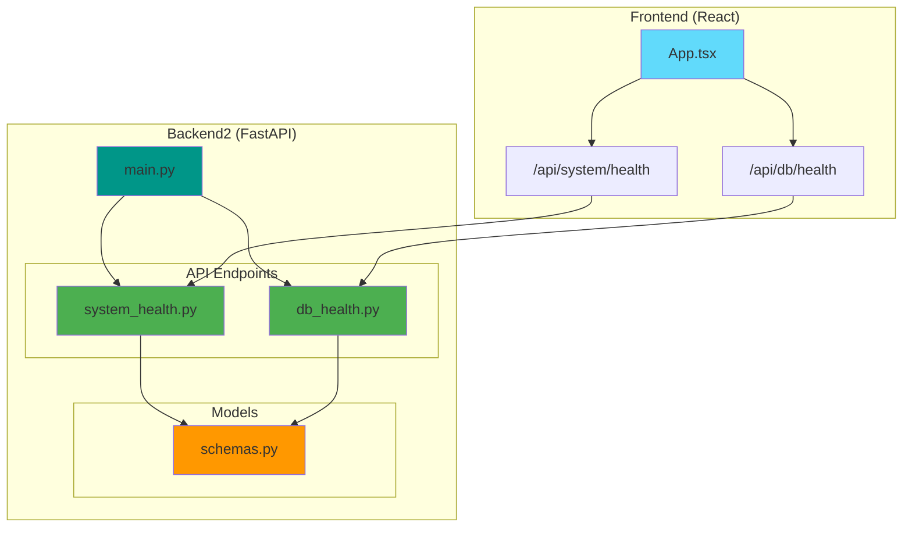
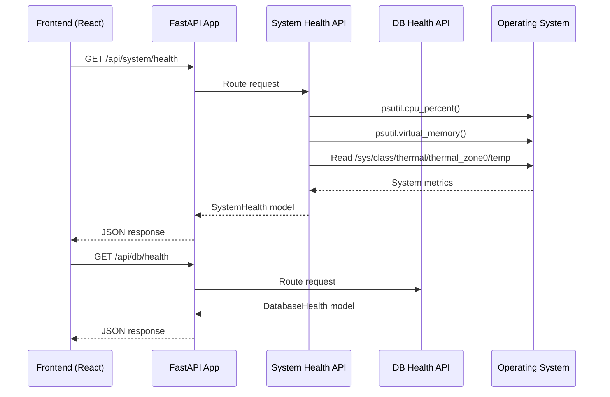

# Backend2 - Frontend Mapping

## Architecture Overview



## API Mapping

### 1. System Health Endpoint

**Frontend Request:**
```typescript
// App.tsx line 22
const response = await fetch("/api/system/health");
```

**Backend Implementation:**
```
File: api/system_health.py
Endpoint: GET /api/system/health
Returns: SystemHealth {
  cpu_percent: float
  memory_percent: float
  disk_percent: float
  temperature: float | null
}
```

**Usage in Frontend:**
```typescript
// App.tsx line 54-57
{
  label: "Pi CPU Load",
  value: `${Math.round(systemHealth.cpu_percent)}%`,
  delta: Math.round(systemHealth.cpu_percent)
}
```

---

### 2. Database Health Endpoint

**Frontend Request:**
```typescript
// App.tsx line 31
const response = await fetch("/api/db/health");
```

**Backend Implementation:**
```
File: api/db_health.py
Endpoint: GET /api/db/health
Returns: DatabaseHealth {
  status: "ok" | "error"
}
```

**Usage in Frontend:**
```typescript
// App.tsx line 115
DB: {dbStatus}
```

---

## File Structure

```
backend2/
├── main.py                 # FastAPI app entry point
├── requirements.txt        # Python dependencies
├── models/
│   └── schemas.py         # Pydantic models
└── api/
    ├── system_health.py   # System metrics endpoint
    └── db_health.py       # Database health endpoint
```

---

## Data Flow



---

## Frontend Components Mapping

```mermaid
graph LR
    subgraph "Frontend Components"
        APP[App.tsx]
        STATS[Stats Cards]
        CONSOLE[Live Console]
        HEALTH[Pipeline Health]
    end
    
    subgraph "Backend Endpoints"
        SYS_API[/api/system/health]
        DB_API[/api/db/health]
    end
    
    APP --> STATS
    APP --> HEALTH
    
    STATS --> SYS_API
    HEALTH --> DB_API
    
    style APP fill:#61dafb
    style STATS fill:#90caf9
    style CONSOLE fill:#ffb74d
    style HEALTH fill:#81c784
```

---

## Running the Backend

```bash
# Install dependencies
pip install -r requirements.txt

# Run server
uvicorn main:app --reload --host 0.0.0.0 --port 8000
```

---

## Notes

- **Hardcoded Data in Frontend:** Traffic (128 Mbps) and Alerts (3) are static
- **Missing Endpoints:** Console logs and healing patches not implemented
- **Simplified:** No database connection, returns mock "ok" status
- **Production Ready:** Add proper error handling and logging
