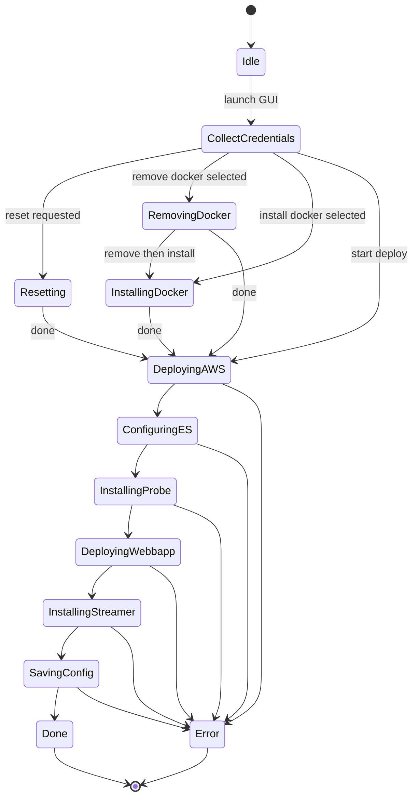
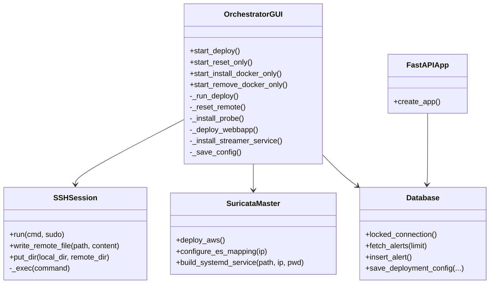

# Webbapp Diagrams

## State Machine

```mermaid
stateDiagram
  [*] --> Idle
  Idle --> CollectCredentials: launch GUI
  CollectCredentials --> Resetting: reset requested
  CollectCredentials --> RemovingDocker: remove docker selected
  CollectCredentials --> InstallingDocker: install docker selected
  CollectCredentials --> DeployingAWS: start deploy

  Resetting --> DeployingAWS: done
  RemovingDocker --> InstallingDocker: remove then install
  RemovingDocker --> DeployingAWS: done
  InstallingDocker --> DeployingAWS: done

  DeployingAWS --> ConfiguringES
  ConfiguringES --> InstallingProbe
  InstallingProbe --> DeployingWebbapp
  DeployingWebbapp --> InstallingStreamer
  InstallingStreamer --> SavingConfig
  SavingConfig --> Done

  Done --> [*]

  DeployingAWS --> Error
  ConfiguringES --> Error
  InstallingProbe --> Error
  DeployingWebbapp --> Error
  InstallingStreamer --> Error
  SavingConfig --> Error
  Error --> [*]
```

## Class Diagram

```mermaid
classDiagram
  class OrchestratorGUI {
    +start_deploy()
    +start_reset_only()
    +start_install_docker_only()
    +start_remove_docker_only()
    -_run_deploy()
    -_reset_remote()
    -_install_probe()
    -_deploy_webbapp()
    -_install_streamer_service()
    -_save_config()
  }

  class SSHSession {
    +run(cmd, sudo)
    +write_remote_file(path, content)
    +put_dir(local_dir, remote_dir)
    -_exec(command)
  }

  class SuricataMaster {
    +deploy_aws()
    +configure_es_mapping(ip)
    +build_systemd_service(path, ip, pwd)
  }

  class Database {
    +locked_connection()
    +fetch_alerts(limit)
    +insert_alert()
    +save_deployment_config(...)
  }

  class FastAPIApp {
    +create_app()
  }

  OrchestratorGUI --> SSHSession
  OrchestratorGUI --> SuricataMaster
  OrchestratorGUI --> Database
  FastAPIApp --> Database
```
